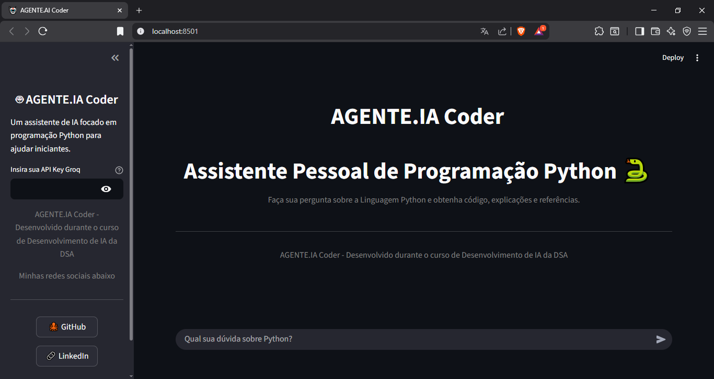

  <h1>AGENTE.IA Coder</h1>

  

===================================| VISÃO GERAL DO PROJETO |======================================

  <h2>Assistente Pessoal de Programação Python</h2> 
    
  
        Visão Geral do Projeto AGENTE.AI Coder, é um aplicativo web interativo que atua como seu Assistente Pessoal de Programação, especializado na Linguagem Python.Este projeto foi desenvolvido como um Estudo de Caso Prático durante as aulas da Data Science Academy (DSA), aplicando a integração de Large Language Models (LLMs) em uma interface construída com Streamlit.
    

  <h2> Funcionalidades agente de IA</h2> 
      

        foi rigorosamente programado para garantir a melhor experiência para o desenvolvedor; Soluções Completas em Python, Responde a qualquer pergunta sobre a linguagem, fornecendo código funcional e exemplos práticos. Formato de Resposta Estruturado, Toda resposta é dividida em Explicação, Código e Lógica, garantindo clareza, Fontes de Aprendizado, Inclui referências diretas à Documentação Oficial do Python ou de bibliotecas usadas, Interface Otimizada, Utiliza Streamlit para um design limpo, com elementos centralizados e uma sidebar para configuração segura da API.
      
  
  <h2>Tecnológia Utilizada</h2>
      

       Frontend: Interface Streamlit, API: LLMGroq
      

 <h2> Conhecimento DSA Aplicado a este projeto</h2> 
     

       demonstração prática dos conceitos aprendidos na Data Science Academy: Desenvolvimento de Aplicativos de Dados com Streamlit, Integração e consumo de APIs de Modelos de Linguagem (LLMs), Engenharia de Prompt (System Prompt) para garantir a saída de dados estruturados e de alta qualidade e Gerenciamento de Estado de Sessão (st.session_state) para manter o histórico da conversa.
     

 
  <h2>Como Rodar Localmente</h2>
  
   <ol> 
    <tittle>Siga os passos para colocar o assistente em funcionamento na sua máquina</tittle>
    <li>Clonar o Repositório: git clone https://github.com/tailann/Assistente-de-IA-Conversacional.git</li>
    <li>Instalar as Dependências: pip install streamlit, pip install groq</li>
    <li>Executar o Aplicativo via terminal: streamlit run AGENTE.IA.py</li>
   </ol>
  
 <h2>Atenção!!</h2> 
   

     Lembre-se de inserir sua API Key Groq na barra lateral do aplicativo ao iniciar
   

   

     Desenvolvido por Tailann Silva como Estudo de Caso da Data Science Academy
   

   

     <a href="https://www.linkedin.com/in/tailan-silva-2b2b79207/">linkedin</a> | <a href="https://github.com/tailann">github</a>
   

